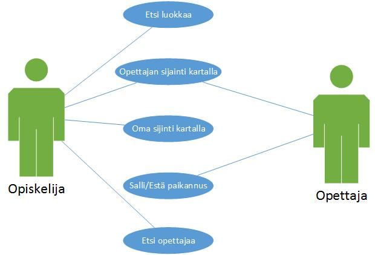

## Käyttötapaukset

#### Järjestelmän loppukäyttäjät

Metropolia ammattikorkeakoulun opiskelijat ovat WhereToGo:n loppukäyttäjiä. Vapaita luokkia opiskelijat yrittävät löytää usein koulupäivänsä aikana ja WhereToGo:n kaltainen sovellus nopeuttaisi vapaiden tilojen tarkistusta. Erityisesti uudet tai toisilla koulukampuksilla vierailevat opiskelijat voivat hyödyntää reitin näyttävää sovellusta suunnistaessaan luokkatiloihin. Opettajan paikannusominaisuus helpottaa opettajien tavoittamista kampuksen sisällä.

#### Käyttötapauskaavio

#### Käyttäjäskenaariot

1. Käyttötapaus: Opiskelijan tavoitteena on löytää vapaa luokka koulurakennuksessa. Hän käynnistää sovelluksen, kirjautuu järjestelmään, ja sovellus määrittää opiskelijan sijainnin. Sovelluksen käynnistyttyä yleisnäkymänä on lista koulun vapaista ja vapautuvista luokista. Luokkien nimet on kirjattu väreillä, joista selviää luokkien statukset (vihreä = vapaa luokka, keltainen = vapautumassa oleva luokka). Luokan nimeä painettaessa näkymä vaihtuu koulun karttaan, johon piirtyy lyhin reitti opiskelijan sijainnista valittuun luokkaan. Sovelluksessa on myös hakupalkki, jonka avulla käyttäjä voi hakea luokkaa tai opettajaa. Hakupalkkia on mahdollista käyttää kaikissa näkymissä.
 

2. Käyttötapaus: Opiskelijan tavoitteena on etsiä opettaja koulurakennuksessa. Hän käynnistää sovelluksen, kirjautuu järjestelmään, ja sovellus määrittää opiskelijan sijainnin. Sovelluksen käynnistyttyä yleisnäkymänä on lista koulun luokista. Näkymän alalaidassa on hakupalkki, johon opiskelija kirjoittaa haettavan opettajan nimen. Jos opettaja on läsnä ja hän on sallinut paikannuksen, näkyy hänen sijaintinsa kartalla. Näin opiskelija näkee opettajan sijainnin, ja hän voi lähteä tavoittelemaan opettajaa.
 

3. Käyttötapaus: Opettaja kirjautuu järjestelmään ja määrittää itsensä paikallaolevaksi, jolloin opiskelijalla on mahdollisuus etsiä ja paikantaa hänet sovelluksen avulla.
 
4. Käyttötapaus (pieleen mennyt): Opiskelijalla on tarkoituksena hakea vapaata luokkaa, johon hän pääsisi tekemään koulutehtäviään. Hän käynnistää sovelluksen, mutta huomaa, että vapaita luokkia ei sillä hetkellä ole yhtäkään. Vapaiden luokkien puutteessa opiskelija voi mennä esimerkiksi kirjastoon tekemään tehtäviään. Opiskelija voi suorittaa luokkahaun myöhemmin uudestaan, ja toivoa, että jokin luokka olisi vapautunut.
 

5. Käyttötapaus (pieleen mennyt): Opiskelijan tavoitteena on löytää opettaja kampuksen tiloista. Sovelluksen käynnistyttyä, hän kirjottaa etsimänsä opettajan nimen hakupalkkiin. Ruudulle ilmestyy viesti "Teacher is not available", joka tarkoittaa siis sitä, että opettaja ei ole paikannettavissa sillä hetkellä. Yleisin syy tilanteeseen on se, että opettaja on säätänyt itsensä paikannuksen pois päältä. Opettajan paikannuksen epäonnistuttua, vaihtoehtoina on tavoitella opettajaa esimerkiksi sähköpostin avulla, tai suorittaa haku myöhemmin uudestaan. 
 

6. Käyttötapaus: Opiskelija hakee luokkaa, jossa hänellä on tunti. Normaalisti reittiä luokkaan ei tulisi näkyviin, koska tila on varattu. Haun jälkeen ruutuun ilmestyy teksti "Classroom is occupied". Kuitenkin opiskelijalla on mahdollisuus saada reitti luokkaan näkyviin "Show route anyway" -nappia painamalla. Näin opeiskelija löytää luokkaan, jossa hänellä on tunti. 

[Next: Järjestelmäarkkitehtuuri](https://github.com/sannakas/ohjelmistotuotanto_2014_rakenne/blob/master/4_jarjestelmaarkkitehtuuri.md)

