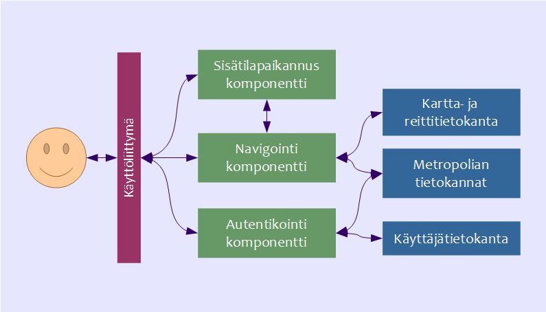

##  Järjestelmäarkkitehtuuri

#### Yleisesti

Järjestelmäarkkitehtuurin kuvauksessa esitellään toimintoineen sellaiset sisäiset loogiset elementit, jotka sovellus tarvitsee toteuttaakseen vaatimusmäärittelyssä osoitetut vaatimukset. Alla olevassa kuvassa on nähtävissä yleiskatsaus WhereToGo-sovelluksen järjestelmäarkkitehtuurista.

#### Tarvittavat komponentit tarkemmin

##### Käyttöliittymä  
	Käyttöliittymä toimii vuorovaikutusalustana käyttäjän ja sovelluksen muiden komponenttien välillä. Käyttöliittymän avulla käyttäjä pääsee hyödyntämään sovelluksen toiminnallisuuksia käsitteleviä komponentteja, sekä niiden tuella sovelluksen käyttämiä tietokantoja. 

##### Sisätilapaikannuskomponentti  
	Selvittää käyttäjän sijaintikoordinaatit mobiililaitteen wlan-signaalivoimakkuuksien avulla ja välittää tiedon sovelluksen navigoinnista vastaavalle komponentille. Lisäksi sovelluksen välityksellä haetun opettajan paikantaminen tapahtuu tämän komponentin avulla.

##### Navigointikomponentti  
	Sijoittaa paikannetun käyttäjän koulurakennuksen kartalle oikeaan kerrokseen n. 5 metrin tarkkuudella oikeasta sijainnista, näyttää reitin haettuun luokkaan tai osoittaa kartalla haetun opettajan sijainnin. Käyttää hyväkseen kartta- ja reittitietoja sisältävää tietokantaa ja hakee luokkatilojen, tilavarausten sekä opettajien tiedot Metropolian tietokannoista.

##### Autentikointikomponentti  
	Sovelluksen käyttöoikeudet vahvistetaan sisäänkirjautumalla, kirjautuminen tapahtuu Metropolian opiskelijan tai opettajan omilla käyttötunnuksilla. Autentikointikomponentin välityksellä haetaan tarvittavat tiedot koulun serveriltä. Komponentti myös tallettaa käyttäjätietokantaan opettajan kohdalle tiedon, onko tämä sallinut itseään paikannettavan koulun alueella. 	

##### Kartta- ja reittitietokanta  
	Kartta - ja reittitiedot ovat talletettuina tietokantaan, josta sovellus pääsee niitä hyödyntämään. 

##### Metropolian tietokannat  
	Metropolian tietokantojen välityksellä saadaan selville opettajien ja luokkatilojen nimet sekä tilavaraukset kussakin koulurakennuksessa. 

##### Käyttäjätietokanta  
	Käyttäjätietokantaan tallentuu sovellukseen kirjautuneen opettajan nimi ja paikannettavuusstatus, jonka sovellus tarkistaa käyttäjän yrittäessä paikantaa opettajaa sovelluksen avulla. 

[Next: Vaatimukset](https://github.com/sannakas/ohjelmistotuotanto_2014_rakenne/blob/master/5_vaatimukset.md)