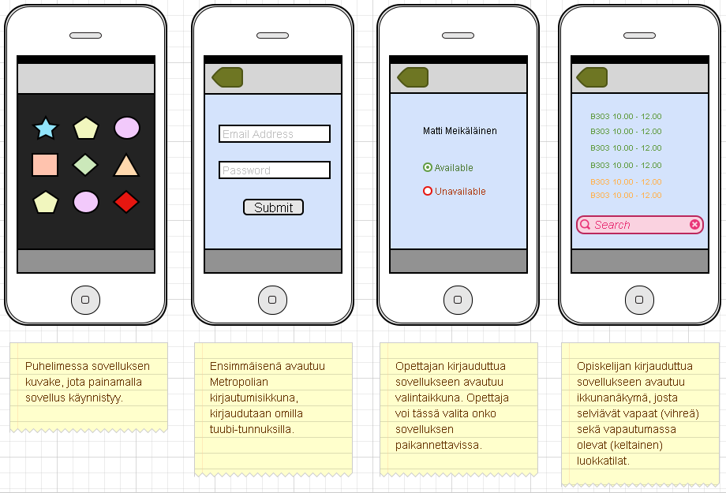

## Käyttöliittymä

* listaa käyttöliittymän näkymät
* niiden keskinäiset suhteet
* kuvaile mitä näkymässä tapahtuu / tehdään

Millaisia näkymiä järjestelmässä on? Miten toiminnallisuuksia niissä 
on?
Kuvaile jokainen näkymä ja mihin sitä käytetään 
Kuvaile siirtymät käyttöliittymänäkymien välillä

--

#### Näkymät ja kuvaukset

#### Näkymien väliset suhteet

[Next: Yhteenveto](https://github.com/sannakas/ohjelmistotuotanto_2014_rakenne/blob/master/7_yhteenveto.md)
