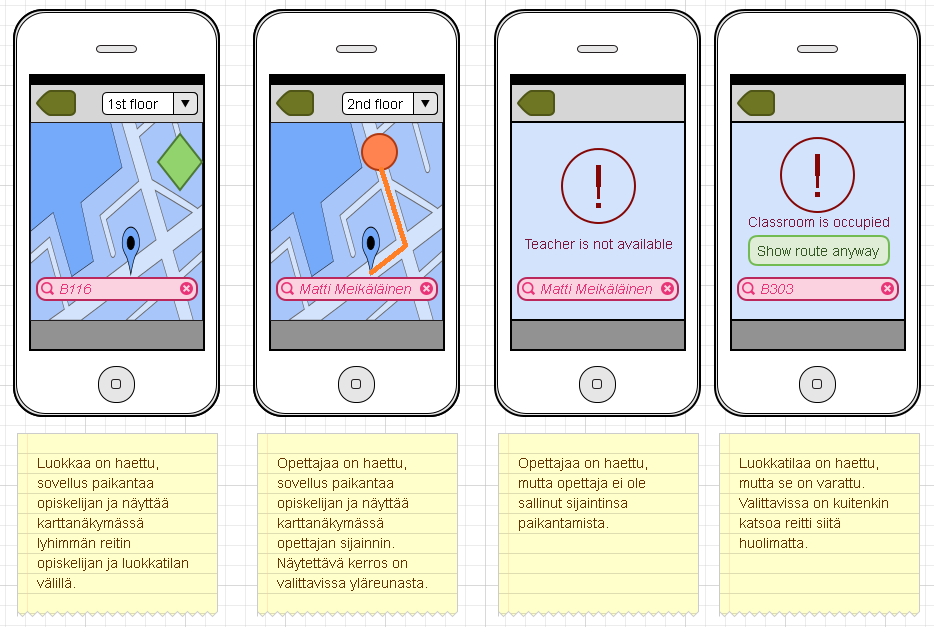

## Käyttöliittymä

#### Näkymät ja kuvaukset

#### Näkymien väliset suhteet

**1. Kirjautumisruutu**  
	* Vihreä nuoli-näppäin yläkulmassa sulkee sovelluksen tässä näkymässä
	* Kirjautumistietojen täytyttyä Submit-näppäin ohjaa
		* Opettajan aloitusnäkymään 2. i)
		* Opiskelijan aloitusnäkymään 2. ii)

**2. Aloitusnäkymät**  
	1. Opettajan paikannettavuusvalinta  
		* Vihreä nuoli-näppäin yläkulmassa sulkee sovelluksen tässä näkymässä
		* Available -valinta sallii opettajan paikannuksen
		* Unavailable -valinta kieltää paikannuksen

	2. Opiskelijan aloitusnäkymä  
		* Vihreä nuoli-näppäin yläkulmassa sulkee sovelluksen tässä näkymässä 
		* Vapaan tai vapautuvan luokan nimeä näpäyttämällä siirrytään karttanäkymään 3. i)
		* Luokkaa (= vapaa) haettaessa hakupalkin avulla siirrytään karttanäkymään 3. i)
		* Luokkaa (= varattu) haettaessa hakupalkin avulla siirrytään virhenäkymään 4. ii)
		* Opettajaa (= sallinut paikannuksen) haettaessa hakupalkin avulla siirrytään karttanäkymään 3. ii)
		* Opettajaa (= kieltänyt paikannuksen) haettaessa hakupalkin avulla siirrytään virhenäkymään 4. i)

**3. Karttanäkymät**  
	1. Luokan paikannusnäkymä  
		* Vihreä nuoli-näppäin yläkulmassa palauttaa aloitusnäkymään tässä näkymässä 
		* Yläreunan valitsimen avulla siirrytään koulurakennuksen kerroksia vastaavien karttojen välillä
		* Hakupalkin kautta siirrytään samalla tavalla kuin aloitusnäkymässä

	2. Opettajan paikannusnäkymä  
		* Vihreä nuoli-näppäin yläkulmassa palauttaa aloitusnäkymään tässä näkymässä
		* Yläreunan valitsimen avulla siirrytään koulurakennuksen kerroksia vastaavien karttojen välillä
		* Hakupalkin kautta siirrytään samalla tavalla kuin aloitusnäkymässä

**4. Virhenäkymät**  
	1. Opettajan paikannus ei ole sallittu  
		* Vihreä nuoli-näppäin yläkulmassa palauttaa aloitusnäkymään tässä näkymässä
		* Hakupalkin kautta siirrytään samalla tavalla kuin aloitusnäkymässä

	2. Luokkatila on varattu  
		* Vihreä nuoli-näppäin yläkulmassa palauttaa aloitusnäkymään tässä näkymässä
		* Show route anyway -näppäin ohjaa karttanäkymään 3. i)
		* Hakupalkin kautta siirrytään samalla tavalla kuin aloitusnäkymässä

[Next: Yhteenveto](https://github.com/sannakas/ohjelmistotuotanto_2014_rakenne/blob/master/7_yhteenveto.md)
